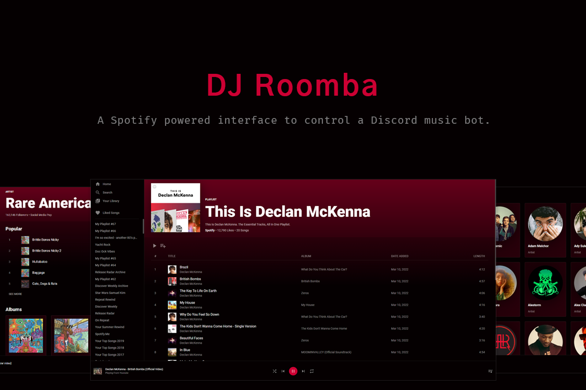

<h1 align="center">
  DJ Roomba
</h1>
<p align="center">
 A Spotify inspired interface for controlling a Discord music bot complete with playlist, album, artistm liked songs and library pages.
</p>

## Installation

1. Install the required dependencies

   ```sh
   npm install
   ```

2. Start the development server

   ```sh
   npm run start
   ```

## Building for production

1. Generate a production build

   ```sh
   npm run build
   ```
